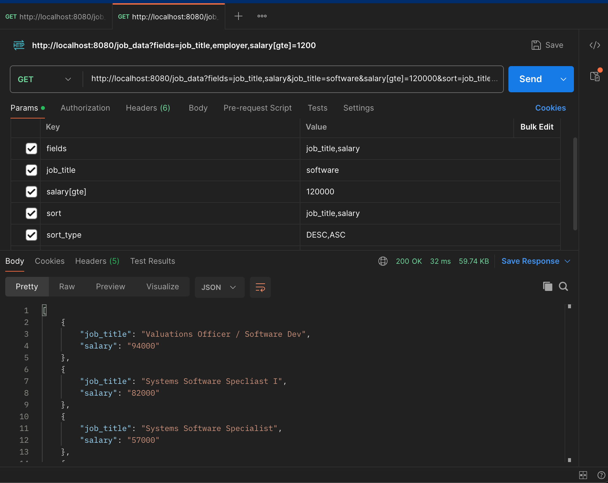
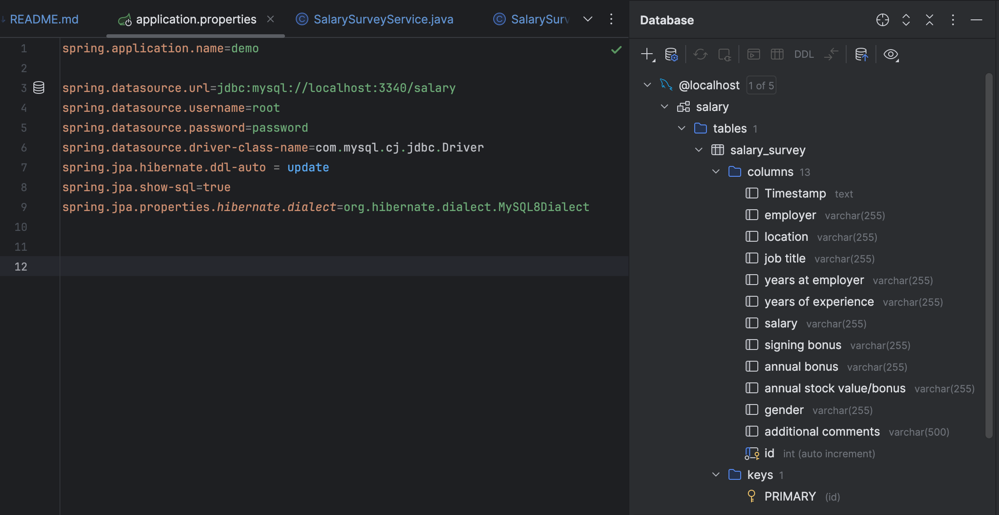

# ata-backend-java
 
## Result

* Use Gradle as a build automation tool.

## DB Settings

* To import the input file (salary_survey.csv) into DB, all type of columns need to be `text`.
* Adding `id` as primary key with `long` type.